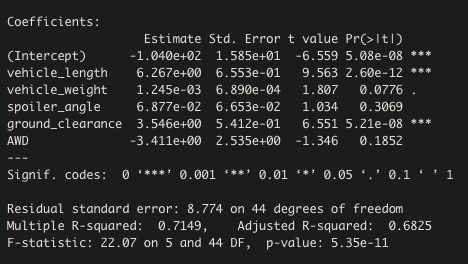
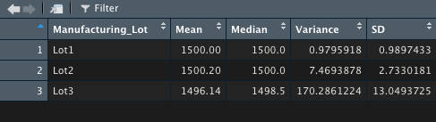
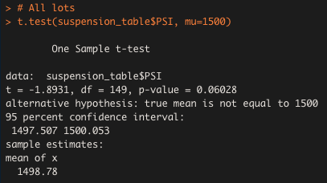
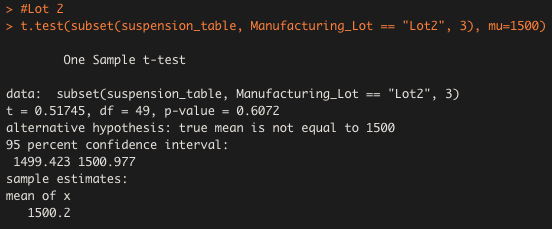
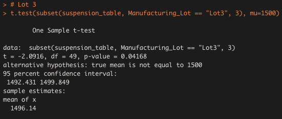

# MechaCar Statistical Analysis
Using R to conduct linear regression and T-Test analyses to compare car production and car performance factors.

## Overview
 The purpose of this project was to make predictions and evaluations around hypothetical ‘MechaCar’ prototypes.  First, a multiple linear regression was conducted to predict fuel efficiency.  Second, descriptive statistics were used to explore suspension coil data across several manufacturing facilities.  Third, T-Test statistical analyses were performed on the suspension coil data to evaluate compliance to manufacturing standards. Lastly, additional analyses explored that may be used to investigate how MechaCar might perform against the competition. 

### Resources
  * RStudio
  * R
  * MechaCar Data

# Results
The following analyses were performed to evaluate the performance of MechaCar prototypes and production facilities. 

## Linear Regression to Predict MPG
First, a multiple linear regression analysis was performed on the MechaCar data to determine which variables were predictive of miles per gallon (mpg) performance. Overall, the model was predictive of miles per gallon performance. As can be seen in the Estimates column, the slopes are quite small but not zero.  The multiple R squared was .71 suggesting that 71% of the change in mpg could be attributed to the model. The F statistic was also significant with a p value < .05 (p = 5.35e -11). Of the variables tested, vehicle length (6.267e+00, p = 2.60e-12) and ground clearance (3.546e+00, p = 5.21e-08) were positively and significantly related to mpg. 

Figure 1. Multiple Linear Regression Output

## Summary Statistics on Suspension Coils
The design specifications for the MechaCar suspension coils dictate that the variance of the suspension coils must not exceed 100 pounds per square inch. Although summary  manufacturing data across all lots (Figure 2)  suggests that in general this design specification is met, investigating individual manufacturing lot data (Figure 3) reveals that lot three fails to meet this threshold for psi variance.

Figure 2. Summary Coil PSI Stats

Figure 3. Coil PSI Stats by Lot

## T-Tests on Suspension Coils
This analysis used an RScript for a t-test that compared all manufacturing lots against the mean PSI of the population (Figure 4). As can be seen in the resulting output, no significant difference was found between the mean psi across all manufacturing lots (1490.78, p= 0.06) and the mean threshold of 1500 psi. To investigate further additional RScripts were written for three t-tests that compared each manufacturing lot against mean PSI of the population (Figures 5 - 7). As can be seen in Figure 7, manufacturing lot three mean psi was statistically significantly lower (1496.14, p = 0.04) than the standard threshold of 1500. Lots one and two however were not statistically significantly different. 

Figure 4. All Lots T-Test

Figure 5. Lot One T-Test

Figure 6. Lot Two T-Test

Figure 7. Lot Three T-Test

## Study Design: MechaCar vs Competition
To further evaluate the MechaCar, additional studies could be done to compare against competing cars. For example, potential analyses could investigate comparisons of miles per gallon fuel efficiency, average maintenance costs, average resale value, engine life in total miles driven, etc. The null hypothesis of each test would be that there were no statistically significant differences between the Mechacar and the competition cars. The alternative hypotheses would be that the MechaCar was statistically significantly different in favorable ways to  the competition cars. In each of these test cases Two Sample T-tests could be used to directly compare the test metrics of MechaCar against the competition. Alternatively, Multiple linear regressions could be used to compare relative contributions of predictor variables on outcomes for MechaCar vs  relative contributions of predictor variables on outcomes for competition vehicles. 

